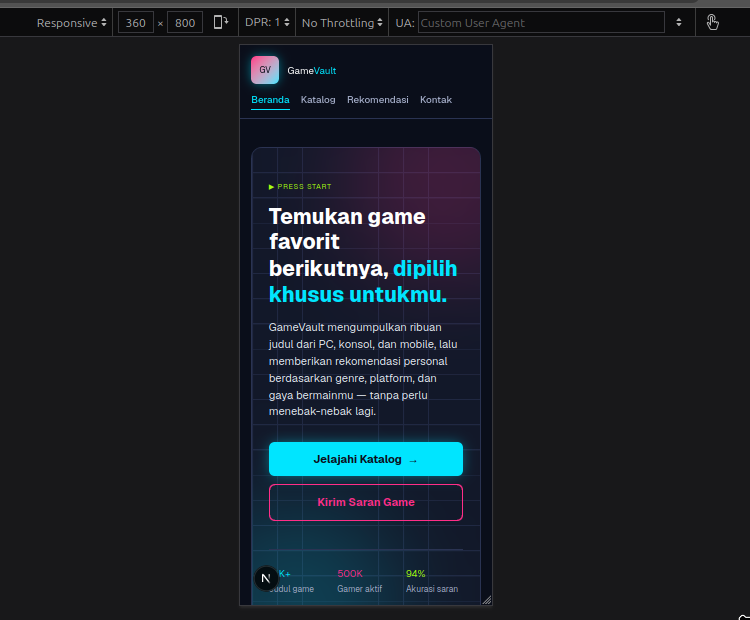
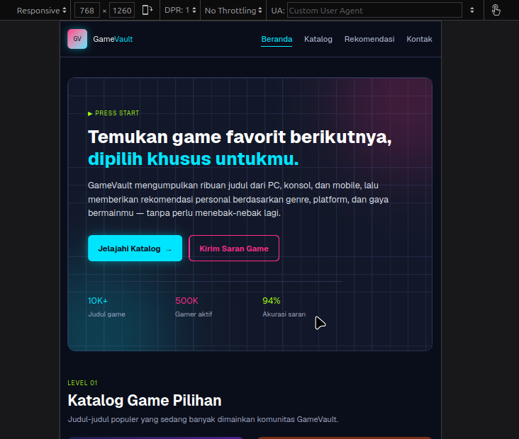
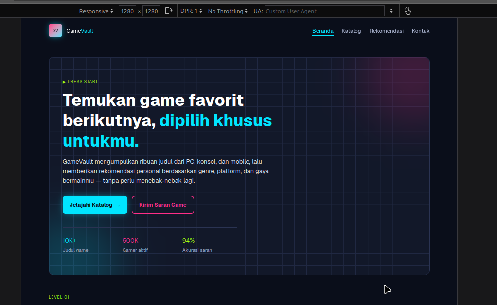

# Dokumen Teknis Praktikum Web — Modul 2

 Nama : Moh Ilham Ramadhan Kurniawan
 Nim : 105224014

### 1. Struktur Semantik

Halaman utama GameVault menggunakan elemen HTML semantik untuk membentuk struktur dokumen yang jelas dan mudah dipahami oleh browser maupun teknologi bantu.

Struktur utama halaman adalah sebagai berikut:

```text
body
├── skip link (Lewati ke konten utama)
├── header
│   └── nav — Navigasi utama
├── main#konten
│   ├── hero
│   │   ├── h1 — Temukan game favorit berikutnya...
│   │   └── paragraf deskripsi
│   ├── section#katalog
│   │   ├── h2 — Katalog Game Pilihan
│   │   └── daftar game
│   │       └── article + h3 untuk setiap game
│   ├── section#cara-kerja
│   │   ├── h2 — Bagaimana Rekomendasi GameVault Bekerja
│   │   └── ol berisi langkah rekomendasi
│   │       └── article + h3 untuk setiap langkah
│   ├── aside
│   │   └── daftar game trending
│   └── section#saran
│       ├── h2 — Sarankan Game / Hubungi Kami
│       └── form
│           ├── label + input nama
│           ├── label + input email
│           ├── label + input judul game
│           ├── fieldset + legend + radio platform
│           ├── label + textarea pesan
│           └── button submit
└── footer
    └── nav — Navigasi footer
```

#### Landmark dan elemen semantik

- `<header>` digunakan sebagai bagian kepala halaman dan berisi navigasi utama.
- `<nav aria-label="Navigasi utama">` digunakan untuk mengelompokkan tautan navigasi utama.
- `<main id="konten">` menjadi satu area utama yang berisi konten inti halaman.
- `<section>` digunakan untuk mengelompokkan bagian utama berdasarkan topik, yaitu katalog, cara kerja rekomendasi, dan formulir saran.
- `<aside aria-label="Game trending minggu ini">` digunakan untuk informasi pendukung berupa daftar game yang sedang trending.
- `<article>` digunakan pada kartu game dan setiap langkah rekomendasi karena masing-masing merupakan unit konten yang dapat dipahami secara terpisah.
- `<footer>` digunakan untuk informasi penutup dan navigasi footer.
- Navigasi footer juga menggunakan `<nav aria-label="Navigasi footer">` sehingga tujuan landmark dapat dibedakan oleh teknologi bantu.

#### Hierarki heading

Halaman menggunakan satu `<h1>` pada bagian hero sebagai judul utama halaman. Bagian utama setelahnya menggunakan `<h2>`, sedangkan judul kartu atau subbagian menggunakan `<h3>`.

Pola hierarkinya adalah:

```text
H1 — Temukan game favorit berikutnya, dipilih khusus untukmu.
├── H2 — Katalog Game Pilihan
│   ├── H3 — Nebula Drift
│   ├── H3 — Kingdom of Ash
│   ├── H3 — Pixel Farmers
│   ├── H3 — Shadow Protocol
│   ├── H3 — Turbo Rally X
│   └── H3 — Mystic Puzzle Tower
├── H2 — Bagaimana Rekomendasi GameVault Bekerja
│   ├── H3 — Ceritakan selera bermainmu
│   ├── H3 — Kami analisis riwayat & ulasan
│   ├── H3 — Dapatkan rekomendasi personal
│   └── H3 — Beri umpan balik, makin akurat
└── H2 — Sarankan Game / Hubungi Kami
```

Penggunaan `aria-labelledby` pada beberapa section menghubungkan landmark dengan heading yang menjelaskan isinya. Form juga menggunakan `<label>`, `<fieldset>`, dan `<legend>` sehingga hubungan antara kontrol dan keterangannya jelas.

Selain itu, halaman memiliki **skip link** “Lewati ke konten utama”. Skip link dibuat terlihat ketika mendapat fokus keyboard sehingga pengguna keyboard dapat melewati navigasi dan langsung menuju `<main>`.

#### Bukti Accessibility Tree

Accessibility Tree diperiksa menggunakan Accessibility Inspector pada Firefox. Hasil pemeriksaan menunjukkan adanya `document`, `banner`, `navigation`, `main`, `region`, heading, list, listitem, link, dan elemen semantik lainnya.


Bukti tersebut menunjukkan bahwa struktur semantik halaman berhasil dipetakan ke dalam accessibility tree dan landmark utama dapat dikenali.

---

## 2. Tata Letak Responsif

Halaman GameVault dibuat menggunakan utility Tailwind CSS dengan kombinasi **Flexbox** dan **CSS Grid**. Pendekatan ini digunakan agar susunan konten dapat menyesuaikan ukuran layar tanpa membuat versi halaman yang berbeda untuk desktop dan mobile.

### Flexbox

Flexbox digunakan pada bagian yang membutuhkan susunan satu dimensi, terutama navigasi dan elemen yang tersusun dalam satu baris atau kolom.

Contoh pada navigasi utama:

```tsx
<nav
  aria-label="Navigasi utama"
  className="flex flex-wrap items-center justify-between gap-3"
>
```

Kelas yang digunakan:

- `flex` mengaktifkan Flexbox.
- `flex-wrap` memungkinkan item turun ke baris berikutnya jika ruang horizontal tidak mencukupi.
- `items-center` menyelaraskan item secara vertikal.
- `justify-between` memberikan distribusi ruang antara logo dan menu.
- `gap-3` memberikan jarak antarelemen.

Flexbox juga digunakan pada hero melalui pola:

```text
flex flex-col gap-3 sm:flex-row
```

Pada ukuran kecil tombol disusun secara vertikal, kemudian pada breakpoint `sm` berubah menjadi horizontal.

### Grid

CSS Grid digunakan ketika konten membutuhkan pembagian ruang dalam beberapa kolom.

Contoh paling jelas terdapat pada bagian konten utama dan sidebar:

```tsx
<div className="grid grid-cols-1 gap-8 py-8 lg:grid-cols-[2fr_1fr]">
```

Artinya:

- ukuran dasar menggunakan `grid-cols-1`, sehingga konten tersusun satu kolom.
- pada breakpoint `lg`, layout berubah menjadi dua kolom.
- `lg:grid-cols-[2fr_1fr]` membagi ruang menjadi kolom pertama dua kali lebih besar daripada kolom kedua.
- kolom pertama digunakan untuk penjelasan cara kerja rekomendasi.
- kolom kedua digunakan untuk sidebar game trending.

Grid juga digunakan pada form:

```tsx
className="grid grid-cols-1 gap-5 sm:grid-cols-2"
```

Nama dan email ditampilkan satu kolom pada layar kecil, kemudian menjadi dua kolom mulai breakpoint `sm`.

Pilihan platform menggunakan:

```tsx
className="mt-2 grid grid-cols-1 gap-2 sm:grid-cols-3"
```

sehingga pilihan tetap mudah digunakan pada layar kecil dan dapat ditampilkan lebih rapat pada layar yang lebih lebar.

### Breakpoint yang digunakan

Beberapa breakpoint Tailwind yang digunakan pada halaman adalah:

| Breakpoint | Contoh penggunaan | Fungsi |
|---|---|---|
| Default | `grid-cols-1`, `flex-col` | Tampilan dasar/mobile |
| `sm` | `sm:text-4xl`, `sm:flex-row`, `sm:grid-cols-2`, `sm:grid-cols-3` | Menambah ruang dan mengubah susunan ketika layar lebih lebar |
| `md` | `md:py-16`, `md:flex-row` | Menyesuaikan spacing dan footer pada ukuran menengah |
| `lg` | `lg:text-5xl`, `lg:grid-cols-[2fr_1fr]` | Mengaktifkan layout dua kolom dan ukuran tipografi desktop |

### Bukti pengujian tiga ukuran layar

#### 360 px — Mobile

Pada lebar 360 px, navigasi dan konten tetap berada dalam satu halaman tanpa membutuhkan horizontal scrolling. Hero berubah menjadi susunan yang lebih vertikal dan tombol utama ditampilkan bertumpuk sehingga tetap mudah ditekan pada layar sempit.



#### 768 px — Tablet

Pada lebar 768 px, hero mendapatkan ruang horizontal yang lebih besar. Tombol pada hero sudah dapat ditampilkan berdampingan dan konten utama tetap menggunakan lebar yang terkontrol.



#### 1280 px — Desktop

Pada lebar 1280 px, halaman menggunakan container maksimum `max-w-6xl`. Hero mendapatkan area yang lebih luas dan layout desktop dapat memanfaatkan ruang horizontal dengan lebih efektif.



Berdasarkan ketiga tangkapan layar, layout dapat beradaptasi dari mobile ke desktop melalui kombinasi Flexbox, Grid, breakpoint Tailwind, wrapping, dan batas lebar container.

---

## 3. Audit Aksesibilitas

Audit aksesibilitas dilakukan menggunakan **Lighthouse Accessibility** pada Chrome DevTools. Firefox digunakan untuk pengembangan dan Accessibility Inspector, sedangkan Chrome digunakan ketika membutuhkan Lighthouse karena Firefox tidak menyediakan Lighthouse secara bawaan.

### Hasil audit

#### Halaman utama GameVault

Halaman utama (`/`) mendapatkan skor **100/100 Accessibility** pada Lighthouse.


Hasil ini menunjukkan bahwa audit otomatis Lighthouse tidak menemukan kegagalan aksesibilitas pada halaman utama pada saat pengujian. Lighthouse tetap menyediakan beberapa item yang perlu diperiksa secara manual, sehingga skor otomatis tidak menggantikan pengujian keyboard.

#### Halaman latihan audit

Halaman `/latihan-audit` dibuat khusus untuk latihan menemukan masalah aksesibilitas. Pada audit awal, halaman mendapatkan skor **79/100**.


Beberapa masalah yang ditampilkan Lighthouse pada audit tersebut adalah:

1. **Buttons do not have an accessible name** — tombol hanya berisi ikon SVG sehingga nama yang dapat dibaca teknologi bantu belum tersedia.
2. **Image elements do not have `[alt]` attributes** — elemen gambar belum memiliki teks alternatif.
3. **Form elements do not have associated labels** — input pencarian belum mempunyai label yang terhubung.

Masalah tersebut memang sengaja terdapat pada halaman latihan audit untuk memberikan kondisi awal sebelum perbaikan.

> **Catatan bukti:** folder dokumentasi yang dikumpulkan berisi screenshot skor 79 untuk halaman latihan dan skor 100 untuk halaman utama. Screenshot hasil audit ulang halaman `/latihan-audit` setelah perbaikan belum tersedia pada folder bukti ini, sehingga skor sesudah perbaikan tidak dicantumkan sebagai angka yang belum terverifikasi.

### Perbaikan aksesibilitas pada halaman utama

Pada halaman utama GameVault, beberapa praktik aksesibilitas sudah diterapkan, antara lain:

- seluruh gambar kartu game menggunakan `alt` yang menjelaskan isi gambar;
- input dan textarea mempunyai `<label>` yang terhubung melalui `htmlFor` dan `id`;
- kelompok radio menggunakan `<fieldset>` dan `<legend>`;
- tautan dan tombol mempunyai indikator fokus melalui utility `focus-visible`;
- skip link tersedia untuk melewati navigasi;
- elemen dekoratif diberi `aria-hidden="true"` agar tidak mengganggu pembacaan teknologi bantu;
- rating menggunakan teks tambahan `sr-only` agar maknanya tetap dapat dipahami tanpa mengandalkan simbol bintang saja;
- beberapa section menggunakan `aria-labelledby` untuk menghubungkan region dengan judulnya;
- navigasi diberi `aria-label` agar tujuan landmark dapat dibedakan.

---

## 4. Hasil Pemeriksaan Manual dengan Keyboard

Pemeriksaan keyboard dilakukan secara manual pada halaman utama GameVault.

Hasil pemeriksaan:

- elemen interaktif dapat dijangkau menggunakan tombol `Tab`;
- `Shift + Tab` dapat digunakan untuk kembali ke elemen interaktif sebelumnya;
- urutan fokus berjalan secara normal dan mengikuti urutan visual halaman;
- indikator fokus terlihat pada elemen yang sedang mendapatkan fokus;
- pilihan radio pada form dapat dioperasikan menggunakan `Space`;
- tombol form dapat dioperasikan menggunakan `Enter`;
- tidak ditemukan elemen interaktif yang tidak dapat dijangkau menggunakan keyboard selama pengujian.

Dengan demikian, hasil pemeriksaan manual keyboard dinilai **normal**. Pemeriksaan ini melengkapi hasil Lighthouse karena beberapa aspek seperti logika urutan fokus dan pengalaman keyboard perlu diverifikasi secara manual.

---

## 5. Kendala dan Penyelesaian

### Kendala 1 — Firefox tidak menyediakan Lighthouse secara bawaan

Selama pengerjaan, browser utama yang digunakan adalah Firefox. Firefox menyediakan **Accessibility Inspector** sehingga struktur Accessibility Tree tetap dapat diperiksa, tetapi tidak menyediakan Lighthouse sebagai fitur bawaan seperti Chrome DevTools.

**Penyelesaian:**

Chrome digunakan khusus untuk menjalankan Lighthouse Accessibility. Pengujian Lighthouse dilakukan pada halaman `http://localhost:3000/` dan `http://localhost:3000/latihan-audit`. Firefox tetap digunakan untuk pengembangan dan pemeriksaan Accessibility Tree.

### Kendala 2 — Halaman latihan audit sengaja memiliki masalah aksesibilitas

Halaman `/latihan-audit` dibuat dengan beberapa masalah aksesibilitas untuk memenuhi tujuan latihan audit. Akibatnya skor awal Lighthouse lebih rendah, yaitu 79.

**Penyelesaian:**

Masalah pada halaman latihan diidentifikasi melalui daftar failed audits Lighthouse, terutama terkait accessible name tombol, atribut `alt` pada gambar, dan label form. Halaman latihan digunakan sebagai media pengujian sebelum perbaikan dan tidak dimaksudkan sebagai bagian dari produk utama GameVault.

### Kendala 3 — Perbedaan kebutuhan browser untuk tiap pengujian

Accessibility Tree dan Lighthouse membutuhkan alat yang berbeda dalam workflow pengerjaan.

**Penyelesaian:**

Workflow pengujian dibagi menjadi:

```text
Firefox
├── Development
└── Accessibility Inspector / Accessibility Tree

Chrome
└── Lighthouse Accessibility
```

Dengan pembagian tersebut, pengembangan tetap dapat dilakukan di browser yang nyaman digunakan, sedangkan kebutuhan bukti audit dipenuhi menggunakan browser yang menyediakan alat yang diperlukan.

---

## 6. Pemanfaatan AI

AI digunakan sebagai alat bantu selama proses pengerjaan, bukan sebagai pengganti pemahaman terhadap materi praktikum.

### Antigravity + Claude Sonnet 5.5

**Antigravity** dengan agen **Claude Sonnet 5.5** digunakan untuk membantu proses pembuatan dan pengembangan website GameVault. Agen digunakan untuk membantu menghasilkan dan menyusun kode halaman, struktur komponen, styling, layout responsif, serta penerapan aspek aksesibilitas pada implementasi web.

Hasil dari proses tersebut kemudian dijalankan dan diuji pada project secara langsung untuk memastikan implementasinya sesuai dengan kebutuhan praktikum.

### ChatGPT

**ChatGPT** digunakan untuk membantu memahami isi modul praktikum dan menyelesaikan Dokumen Teknis. Penggunaan ChatGPT terutama mencakup:

- membantu memahami instruksi dan rubrik Modul 2;
- menjelaskan konsep semantic HTML, Flexbox, Grid, responsive layout, dan accessibility;
- membantu menentukan bukti pengujian yang perlu dikumpulkan;
- membantu memahami hasil Accessibility Tree dan Lighthouse;
- membantu menyusun dan merapikan Dokumen Teknis dalam format Markdown;
- membantu mengorganisasi hasil pengujian menjadi dokumentasi yang sistematis.

Penggunaan AI tetap disertai pemeriksaan langsung terhadap source code, tampilan halaman, Accessibility Tree, Lighthouse, dan pengujian keyboard. Dengan demikian, informasi yang dicantumkan dalam dokumen didasarkan pada hasil implementasi dan pengujian project.

---

## 7. Ringkasan Bukti Dokumentasi

| Bukti | File | Keterangan |
|---|---|---|
| Tampilan 360 px | `360px.png` | Pengujian layout mobile |
| Tampilan 768 px | `768px.png` | Pengujian layout tablet |
| Tampilan 1280 px | `1280px.png` | Pengujian layout desktop |
| Accessibility Tree | `Accessibility Tree.png` | Struktur accessibility tree halaman utama |
| Lighthouse halaman utama | `Audit 100.png` | Accessibility **100/100** pada `/` |
| Lighthouse latihan audit | `Audit 79.png` | Accessibility **79/100** pada `/latihan-audit` |
| Tes keyboard | Tidak berupa screenshot | Hasil pemeriksaan manual: normal |

## 8. Kesimpulan

Implementasi GameVault telah menggunakan struktur HTML semantik dengan landmark utama berupa `header`, `nav`, `main`, `section`, `aside`, dan `footer`, serta hierarki heading yang terstruktur. Layout responsif dibangun menggunakan kombinasi Flexbox dan Grid dengan breakpoint Tailwind sehingga halaman dapat menyesuaikan ukuran layar 360 px, 768 px, dan 1280 px.

Dari sisi aksesibilitas, halaman utama memperoleh skor **100/100** pada Lighthouse Accessibility. Accessibility Tree juga menunjukkan landmark dan elemen semantik yang sesuai. Pemeriksaan keyboard secara manual menunjukkan bahwa elemen interaktif dapat dijangkau dan dioperasikan menggunakan keyboard dengan urutan fokus yang normal.

Halaman `/latihan-audit` digunakan sebagai halaman latihan untuk mengidentifikasi masalah aksesibilitas. Audit awal menghasilkan skor **79/100** dan menunjukkan masalah pada accessible name tombol, atribut `alt` gambar, serta label form. Halaman tersebut digunakan untuk proses latihan audit dan bukan merupakan bagian dari produk utama GameVault.

Secara keseluruhan, hasil implementasi dan pengujian menunjukkan bahwa GameVault telah menerapkan prinsip dasar struktur semantik, responsive design, dan accessibility sesuai kebutuhan praktikum.
